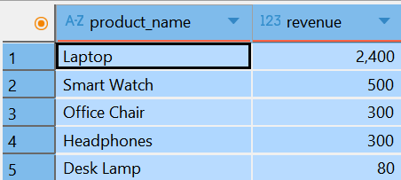
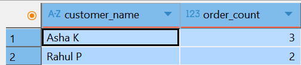
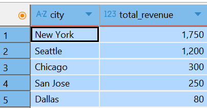
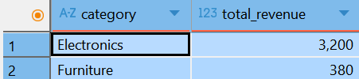
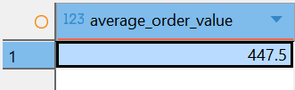

# E-Commerce Business Analysis (SQL)

Welcome to the *"E-Commerce Business Analysis"* project!

In this project, I designed a relational database for an e-commerce store using PostgreSQL, and performed SQL analysis to uncover customer behavior, product performance, and revenue trends. The focus is on generating practical business insights using real-world SQL queries.

---

## Tools Used

**PostgreSQL** – Relational database to store and query data  
**DBeaver** – SQL client used to interact with PostgreSQL  

> Note: This project was built and executed in DBeaver, connected to a PostgreSQL database.

---

## Database Structure

This project includes 5 main tables:

| Table         | Description                                                              |
| ------------- | ------------------------------------------------------------------------ |
| `customers`   | Stores customer details: name, email, city, country, signup date         |
| `products`    | Stores product details: name, category, price                            |
| `orders`      | Records customer orders: customer ID, order date, status                 |
| `order_items` | Links orders to products with quantity and price                         |
| `payments`    | Tracks payments: order ID, payment method, amount, payment date          |

---

## Skills Demonstrated

* SQL Joins (INNER JOIN, multi-table joins)  
* Aggregations (SUM, COUNT, AVG)  
* Grouping & Filtering (GROUP BY, HAVING)  
* Date-based analysis (monthly trends)  
* Window functions (RANK, ranking by revenue)  
* Business insight generation and interpretation  

---

## Analysis – Story Style

This project answers real business questions:

* Total Revenue – Total revenue generated by the store  
* Top Products – Best-selling products, helping identify customer favorites  
* Repeat Customers – Customers who made multiple purchases, highlighting loyalty  
* Monthly Revenue Trend – Month-over-month revenue analysis, showing growth or seasonal trends  
* Revenue by City – Revenue contribution by city, guiding regional strategies  
* Revenue by Category – Revenue by product category, informing stocking and marketing decisions  
* Category Performance Month by Month – Trends for each category over time  
* Customer Lifetime Value – Total spending per customer, highlighting high-value clients  
* Average Order Value (AOV) – Typical spending per order  
* Ranking Products – Products ranked by revenue, identifying top revenue drivers

Each analysis provides actionable insights for smarter business decisions and strategic planning.

---
## 📸 Results (Query Outputs)

### 🔹 Total Revenue

*Displays the total revenue generated from all orders.*

---

### 🔹 Top-Selling Products

*Identifies the best-selling products based on quantity sold.*

---

### 🔹 Revenue Per Product

*Shows how much revenue each product contributes to the business.*

---

### 🔹 Repeat Customers

*Highlights customers who made more than one purchase, indicating loyalty.*

---

### 🔹 Monthly Revenue Trend

*Analyzes revenue growth month by month to identify business trends.*

---

### 🔹 Revenue by City

*Displays revenue contribution by different cities for regional insights.*

---

### 🔹 Revenue by Category

*Breaks down revenue by product categories to guide marketing and inventory decisions.*

---

### 🔹 Average Order Value (AOV)

*Shows the typical amount spent per order.*

---

### 🔹 Customer Lifetime Value

*Ranks customers based on total spending, highlighting high-value clients.*

---

### 🔹 Product Revenue Ranking

*Ranks products by total revenue using SQL window functions.*

---

### 🔹 Category Performance Over Time

*Tracks category-wise revenue month by month to identify trends and seasonality.*

## Key Insights

* The Electronics category generates the highest revenue  
* Repeat customers contribute significantly more revenue than one-time buyers  
* Revenue shows steady month-over-month growth, indicating a healthy business  
* Data-driven insights help optimize product offerings, marketing strategies, and customer retention  

---

## Project Purpose

This project demonstrates:

* SQL practice – Executing complex queries with joins, aggregates, and window functions  
* Business understanding – Translating raw data into actionable insights  
* Strategic planning – Identifying top products, loyal customers, and revenue patterns  
* Real-world application – Techniques used by e-commerce businesses, retail analytics teams, and data-driven organizations to monitor KPIs and optimize operations  

---

## How to Run This Project

1. Clone this repository to your local machine.  
2. Open DBeaver and connect it to your **PostgreSQL** server.  
3. Create a new database (e.g., `ecommerce_project`).  
4. Run the provided SQL script to create tables and insert sample data.  
5. Execute the SELECT queries to explore analytics and generate insights.  
6. Modify or expand the dataset to experiment with more complex scenarios.  

---

## Author

**Asha Kalavagunta**  
*Master’s in Information Technology | Aspiring Data Analyst / Business Intelligence*  

